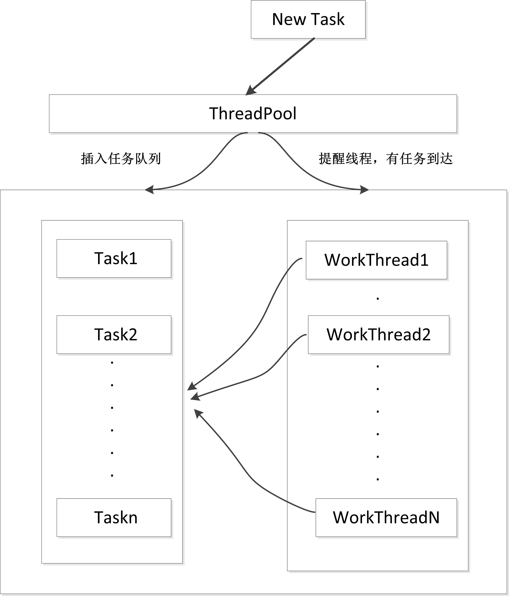
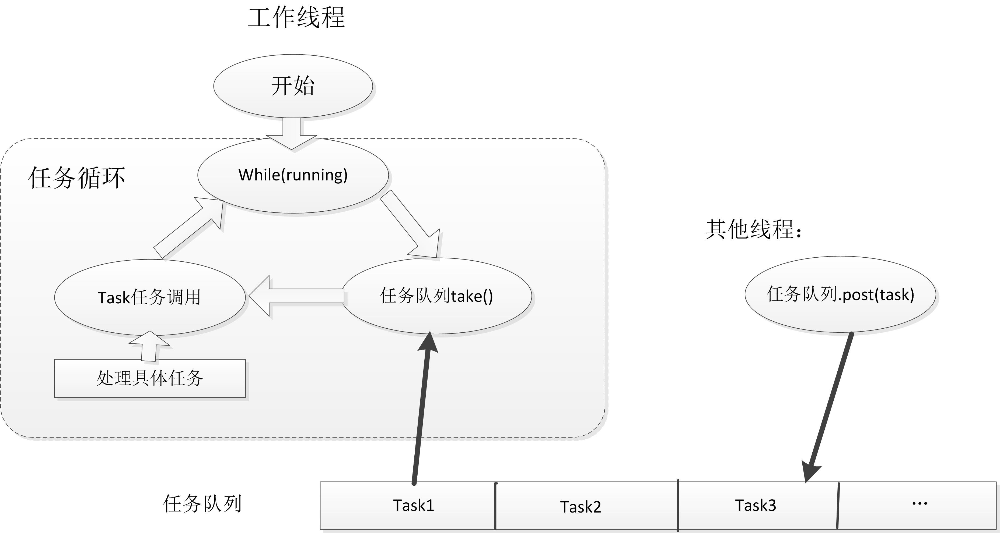

### 为什么要使用线程池？  
1. 一个医院，每天面对成千上万的病人，处理方式是：来一个病人找来一个医生处理，处理完了医生也走了。当看病时间较短的时间，医生来去的时间，显得尤为耗时。  
2. 医院引进了线程池的概念。 设置门诊，把医生全派出去坐诊，病人来看病先挂号排队，医生根据病人排队顺序依次处理各个病人，这样就省去医生来去的时间。但是，很多时候病人不多，医生却很多导致很多医生空闲浪费资源。
3. 医院引进了可伸缩性线程池的概念， 刚开始，只派出部门医生，但是增加一个领导，病人依旧排队看病，领导负责协调整个医院的医生。当病人很多，医生忙不过来的时候，领导就多叫几个医生来帮忙；当病人不多的时候，领导就叫一些空闲的医生回家休息免得浪费医院资源。

总的来说，线程池包括：n个执行任务的工作线程，一个任务队列，一个管理线程  
1. 预先启动一些线程，线程负责执行任务队列中的任务，当队列为空，线程挂起。  
2. 调用的时候，直接往任务队列添加任务，并发信号通知线程有任务要执行  
3. 管理线程负责监控任务队列和系统中的线程的状态，当任务队列为空，而且线程很多处于空闲状态，便通知一些线程退出以节约资源；当任务队列任务多且线程都在忙，便启动一些线程来执行任务，以确保效率。  
下图为线程池的流程图：  

  
处理流程：  
- 当任务队列中有任务时，各线程中队列中取任务并执行任务  
- 若任务队列中没有任务，各线程阻塞等待  
- 若有新任务到达，唤醒一个线程，去处理新来的任务  

下图为工作线程的示意图：  

  
处理流程：  
在没有任务时阻塞等待，当收到新任务的信号，循环的执行任务


注意，在工作线程(workthread)中，不停的循环取任务执行，这里的任务是与具体任务无关的，只是一个任务接口类，供用户自己实现

### 网上一个不错的教程
```cpp
#include <stdlib.h>
#include <pthread.h>
#include <unistd.h>
#include <assert.h>
#include <stdio.h>
#include <string.h>
#include <signal.h>
#include <errno.h>
#include "threadpool.h"
#define DEFAULT_TIME 10 // 领导定时检查队列、线程状态的时间间隔
#define MIN_WAIT_TASK_NUM 10 // 队列中等待的任务数>这个值，便会增加线程
#define DEFAULT_THREAD_VARY 10 //每次线程加减的数目

typedef struct
{
    void *(*function)(void *);
    void *arg;
} threadpool_task_t;

struct threadpool_t
{
    pthread_mutex_t lock;// mutex for the taskpool
    pthread_mutex_t thread_counter;//mutex for count the busy thread
    pthread_cond_t queue_not_full;
    pthread_cond_t queue_not_empty;//任务队列非空的信号
    pthread_t *threads;//执行任务的线程
    pthread_t adjust_tid;//负责管理线程数目的线程
    threadpool_task_t *task_queue;//任务队列
    int min_thr_num;
    int max_thr_num;
    int live_thr_num;
    int busy_thr_num;
    int wait_exit_thr_num;
    int queue_front;
    int queue_rear;
    int queue_size;
    int queue_max_size;
    bool shutdown;
};
/**
* @function  void *threadpool_thread(void *threadpool)
* @desc     the worker thread
* @param threadpool the pool which own the thread
*/
void *threadpool_thread(void *threadpool);
/**
* @function void *adjust_thread(void *threadpool);
* @desc manager thread
* @param threadpool the threadpool
*/
void *adjust_thread(void *threadpool);
/**
* check a thread is alive
*/
bool is_thread_alive(pthread_t tid);
int threadpool_free(threadpool_t *pool);
//创建线程池
threadpool_t *threadpool_create(int min_thr_num, int max_thr_num, int queue_max_size)
{
    threadpool_t *pool = NULL;
    do{
        if((pool = (threadpool_t *)malloc(sizeof(threadpool_t))) == NULL)
        {
            printf("malloc threadpool fail");
            break;
        }
        pool->min_thr_num = min_thr_num;
        pool->max_thr_num = max_thr_num;
        pool->busy_thr_num = 0;
        pool->live_thr_num = min_thr_num;
        pool->queue_size = 0;
        pool->queue_max_size = queue_max_size;
        pool->queue_front = 0;
        pool->queue_rear = 0;
        pool->shutdown = false;
        pool->threads = (pthread_t *)malloc(sizeof(pthread_t)*max_thr_num);
        if (pool->threads == NULL)
        {
            printf("malloc threads fail");
            break;
        }
        memset(pool->threads, 0, sizeof(pool->threads));
        pool->task_queue = (threadpool_task_t *)malloc(sizeof(threadpool_task_t)*queue_max_size);
        if (pool->task_queue == NULL)
        {
            printf("malloc task_queue fail");
            break;
        }
        if (pthread_mutex_init(&(pool->lock), NULL) != 0
            || pthread_mutex_init(&(pool->thread_counter), NULL) != 0
            || pthread_cond_init(&(pool->queue_not_empty), NULL) != 0
            || pthread_cond_init(&(pool->queue_not_full), NULL) != 0)
        {
            printf("init the lock or cond fail");
            break;
        }
        /**
        * start work thread min_thr_num
        */
        for (int i = 0; i < min_thr_num; i++)
        {
            //启动任务线程
            pthread_create(&(pool->threads[i]), NULL, threadpool_thread, (void *)pool);
            printf("start thread 0x%x...\n", pool->threads[i]);
        }
        //启动管理线程
        pthread_create(&(pool->adjust_tid), NULL, adjust_thread, (void *)pool);
        return pool;
    }while(0);
    threadpool_free(pool);
    return NULL;
}
//把任务添加到队列中
int threadpool_add(threadpool_t *pool, void*(*function)(void *arg), void *arg)
{
    assert(pool != NULL);
    assert(function != NULL);
    assert(arg != NULL);
    pthread_mutex_lock(&(pool->lock));
    //队列满的时候，等待
    while ((pool->queue_size == pool->queue_max_size) && (!pool->shutdown))
    {
        //queue full wait
        pthread_cond_wait(&(pool->queue_not_full), &(pool->lock));
    }
    if (pool->shutdown)
    {
        pthread_mutex_unlock(&(pool->lock));
    }
    //如下是添加任务到队列，使用循环队列
    if (pool->task_queue[pool->queue_rear].arg != NULL)
    {
        free(pool->task_queue[pool->queue_rear].arg);
        pool->task_queue[pool->queue_rear].arg = NULL;
    }
    pool->task_queue[pool->queue_rear].function = function;
    pool->task_queue[pool->queue_rear].arg = arg;
    pool->queue_rear = (pool->queue_rear + 1)%pool->queue_max_size;
    pool->queue_size++;
    //每次加完任务，发个信号给线程
    //若没有线程处于等待状态，此句则无效，但不影响
    pthread_cond_signal(&(pool->queue_not_empty));
    pthread_mutex_unlock(&(pool->lock));
    return 0;
}
//线程执行任务
void *threadpool_thread(void *threadpool)
{
    threadpool_t *pool = (threadpool_t *)threadpool;
    threadpool_task_t task;
    while(true)
    {
        /* Lock must be taken to wait on conditional variable */
        pthread_mutex_lock(&(pool->lock));
        //任务队列为空的时候，等待
        while ((pool->queue_size == 0) && (!pool->shutdown))
        {
            printf("thread 0x%x is waiting\n", pthread_self());
            pthread_cond_wait(&(pool->queue_not_empty), &(pool->lock));
            //被唤醒后，判断是否是要退出的线程
            if (pool->wait_exit_thr_num > 0)
            {
                pool->wait_exit_thr_num--;
                if (pool->live_thr_num > pool->min_thr_num)
                {
                    printf("thread 0x%x is exiting\n", pthread_self());
                    pool->live_thr_num--;
                    pthread_mutex_unlock(&(pool->lock));
                    pthread_exit(NULL);
                }
            }
        }
        if (pool->shutdown)
        {
            pthread_mutex_unlock(&(pool->lock));
            printf("thread 0x%x is exiting\n", pthread_self());
            pthread_exit(NULL);
        }
        //get a task from queue
        task.function = pool->task_queue[pool->queue_front].function;
        task.arg = pool->task_queue[pool->queue_front].arg;
        pool->queue_front = (pool->queue_front + 1)%pool->queue_max_size;
        pool->queue_size--;
        //now queue must be not full
        pthread_cond_broadcast(&(pool->queue_not_full));
        pthread_mutex_unlock(&(pool->lock));
        // Get to work
        printf("thread 0x%x start working\n", pthread_self());
        pthread_mutex_lock(&(pool->thread_counter));
        pool->busy_thr_num++;
        pthread_mutex_unlock(&(pool->thread_counter));
        (*(task.function))(task.arg);
        // task run over
        printf("thread 0x%x end working\n", pthread_self());
        pthread_mutex_lock(&(pool->thread_counter));
        pool->busy_thr_num--;
        pthread_mutex_unlock(&(pool->thread_counter));
    }
    pthread_exit(NULL);
    return (NULL);
}
//管理线程
void *adjust_thread(void *threadpool)
{
    threadpool_t *pool = (threadpool_t *)threadpool;
    while (!pool->shutdown)
    {
        sleep(DEFAULT_TIME);
        pthread_mutex_lock(&(pool->lock));
        int queue_size = pool->queue_size;
        int live_thr_num = pool->live_thr_num;
        pthread_mutex_unlock(&(pool->lock));
        pthread_mutex_lock(&(pool->thread_counter));
        int busy_thr_num = pool->busy_thr_num;
        pthread_mutex_unlock(&(pool->thread_counter));
        //任务多线程少，增加线程
        if (queue_size >= MIN_WAIT_TASK_NUM
            && live_thr_num < pool->max_thr_num)
        {
            //need add thread
            pthread_mutex_lock(&(pool->lock));
            int add = 0;
            for (int i = 0; i < pool->max_thr_num && add < DEFAULT_THREAD_VARY
                && pool->live_thr_num < pool->max_thr_num; i++)
            {
                if (pool->threads[i] == 0 || !is_thread_alive(pool->threads[i]))
                {
                    pthread_create(&(pool->threads[i]), NULL, threadpool_thread, (void *)pool);
                    add++;
                    pool->live_thr_num++;
                }
            }
            pthread_mutex_unlock(&(pool->lock));
        }
        //任务少线程多，减少线程
        if ((busy_thr_num * 2) < live_thr_num
            && live_thr_num > pool->min_thr_num)
        {
            //need del thread
            pthread_mutex_lock(&(pool->lock));
            pool->wait_exit_thr_num = DEFAULT_THREAD_VARY;
            pthread_mutex_unlock(&(pool->lock));
            //wake up thread to exit
            for (int i = 0; i < DEFAULT_THREAD_VARY; i++)
            {
                pthread_cond_signal(&(pool->queue_not_empty));
            }
        }
    }
}
int threadpool_destroy(threadpool_t *pool)
{
    if (pool == NULL)
    {
        return -1;
    }
    pool->shutdown = true;
    //adjust_tid exit first
    pthread_join(pool->adjust_tid, NULL);
    // wake up the waiting thread
    pthread_cond_broadcast(&(pool->queue_not_empty));
    for (int i = 0; i < pool->min_thr_num; i++)
    {
        pthread_join(pool->threads[i], NULL);
    }
    threadpool_free(pool);
    return 0;
}
int threadpool_free(threadpool_t *pool)
{
    if (pool == NULL)
    {
        return -1;
    }
    if (pool->task_queue)
    {
        free(pool->task_queue);
    }
    if (pool->threads)
    {
        free(pool->threads);
        pthread_mutex_lock(&(pool->lock));
        pthread_mutex_destroy(&(pool->lock));
        pthread_mutex_lock(&(pool->thread_counter));
        pthread_mutex_destroy(&(pool->thread_counter));
        pthread_cond_destroy(&(pool->queue_not_empty));
        pthread_cond_destroy(&(pool->queue_not_full));
    }
    free(pool);
    pool = NULL;
    return 0;
}
int threadpool_all_threadnum(threadpool_t *pool)
{
    int all_threadnum = -1;
    pthread_mutex_lock(&(pool->lock));
    all_threadnum = pool->live_thr_num;
    pthread_mutex_unlock(&(pool->lock));
    return all_threadnum;
}
int threadpool_busy_threadnum(threadpool_t *pool)
{
    int busy_threadnum = -1;
    pthread_mutex_lock(&(pool->thread_counter));
    busy_threadnum = pool->busy_thr_num;
    pthread_mutex_unlock(&(pool->thread_counter));
    return busy_threadnum;
}
bool is_thread_alive(pthread_t tid)
{
    int kill_rc = pthread_kill(tid, 0);
    if (kill_rc == ESRCH)
    {
        return false;
    }
    return true;
}
// for test
//void *process(void *arg)
//{
//printf("thread 0x%x working on task %d\n ",pthread_self(),*(int *)arg);
//sleep(1);
//printf("task %d is end\n",*(int *)arg);
//return NULL;
//}
//int main()
//{
//threadpool_t *thp = threadpool_create(3,100,12);
//printf("pool inited");
//
//int *num = (int *)malloc(sizeof(int)*20);
//for (int i=0;i<10;i++)
//{
//num[i]=i;
//printf("add task %d\n",i);
//threadpool_add(thp,process,(void*)&num[i]);
//}
//sleep(10);
//threadpool_destroy(thp);
//}
```
